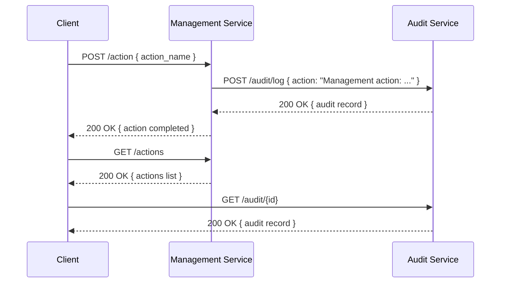

# Sequence Diagram

> Якщо діаграма не відображається, відкрий її у Markdown Preview з розширенням Mermaid.
> Для VS Code рекомендується встановити `Markdown Preview Mermaid Support` або `Markdown Preview Enhanced`.
> Або вставити нижче у https://mermaid.live

