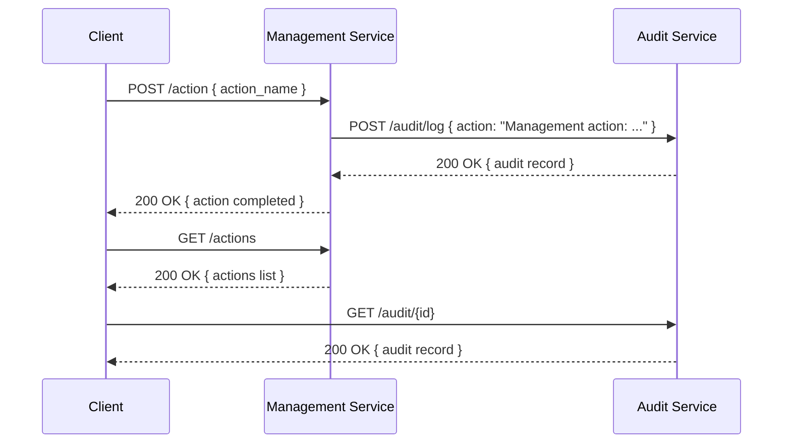

# Sequence Diagram

```mermaid
sequenceDiagram
    participant Client
    participant ManagementService as Management Service
    participant AuditService as Audit Service

    Client->>ManagementService: POST /action { action_name }
    ManagementService->>AuditService: POST /audit/log { action: "Management action: ..." }
    AuditService-->>ManagementService: 200 OK { audit record }
    ManagementService-->>Client: 200 OK { action completed }

    Client->>ManagementService: GET /actions
    ManagementService-->>Client: 200 OK { actions list }

    Client->>AuditService: GET /audit/{id}
    AuditService-->>Client: 200 OK { audit record }
```
